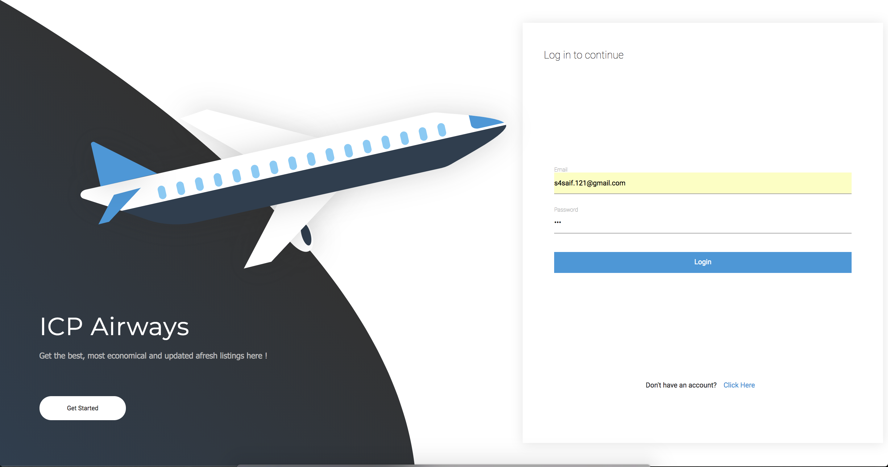
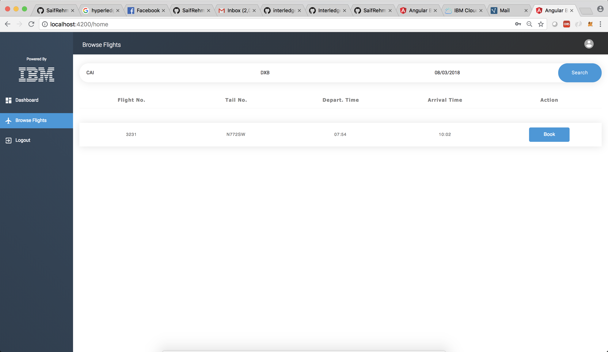
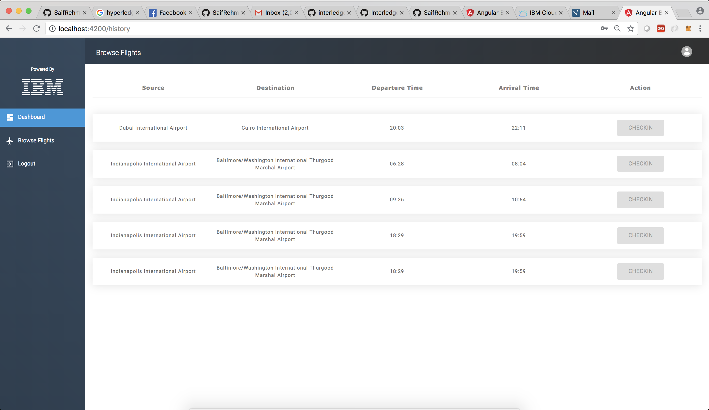
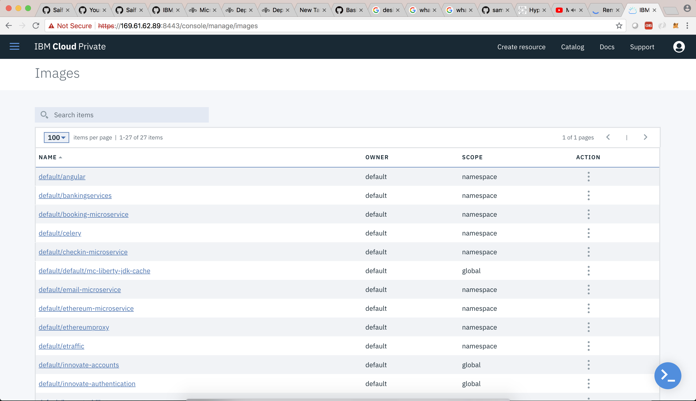
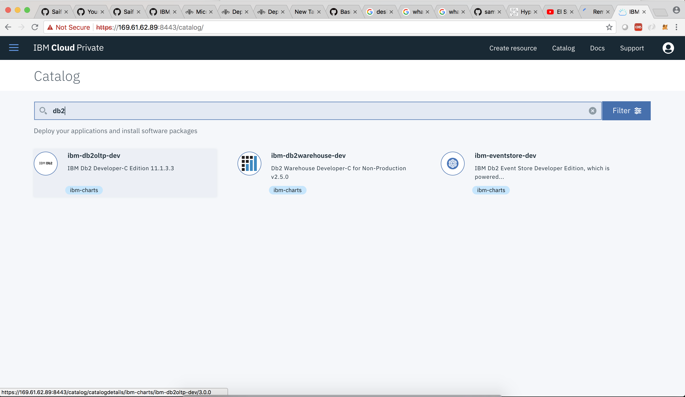
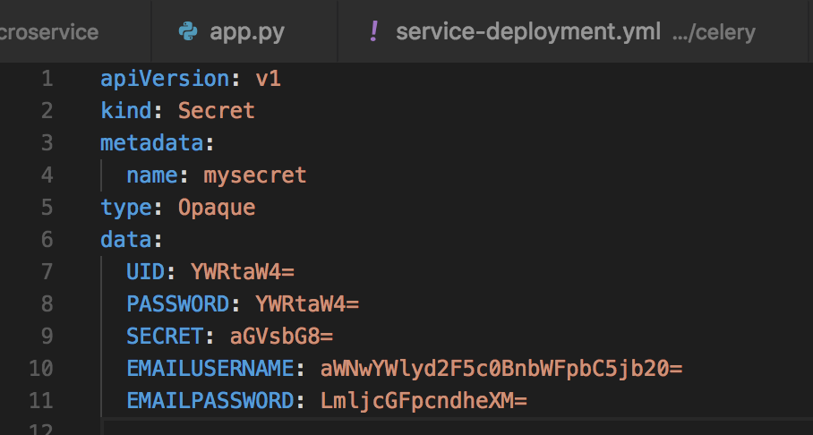

#  ICP-Airways
<h1 align="center">
  <br>
  <a href="https://github.com/SaifRehman/ICP-Airways"></a>
  <br>
      Air-Line ticketing and booking application on IBM Cloud Private 
  <br>
  <br>
</h1>

<h4 align="center">Powered by IBM Cloud Private</h4>

<p align="center">
  <a>
    
  </a>
</p>
<br>

# Building an Airline Booking Application based on Microservices Architecture on IBM Cloud Private
### Introduction

In this Code Pattern, we will build a cloud native application based on microservice architecture, IBM Middlewares and following 12 factor practices. This application is an Airline Booking app, and the technologies behind this app are:- 
* Nodejs (Typescript)
* IBM DB2
* IBM ODM
* RabbitMQ,
* Celery
* Angular
* Hypereledger Fabric
* Hyperledger Burrow
* Solidity
* Docker
* Kubernetes 
* IBM Cloud Private

Cloud native application is a buzzword these days. Technologies like Kubernetes and Docker are picking up reputation and popularity in Cloud native world. This Pattern will show an end to end process of building highly available Cloud Native Application on IBM Cloud Private. The Application backend is based on Nodejs and DB2 as a Database. The frontend is built using Angular4. Distributed Asynchronous task queue is based on RabbitMQ and Celery. Container orchestration is managed by Kubernetes. Finally, the Blockchain is based on Hyperledger Fabric, Hyperledger Burrow and Ethereum Smart Contract. 

### Learning objectives
When you've completed this Code Pattern, you will understand how to:

* Break the application into different microservices
* Deploying microservices based application on IBM Cloud Private
* Leveraging IBM Middlewares such as ODM and DB2 on Kubernetes
* Designing business rules and decision by IBM ODM
* Create distributed task ques using RabbitMQ and Celery
* Leveraging DB2 as backend data storage
* Deploying Ethereum smart contract on Hyperledger fabric by leveraging Hyperledger Burrow
* Learn how to use IBM Cloud Private, Docker, and Kubernetes

### App Screenshot








#### Flow

1. *USER*:- End user who will access the application
2. *APPUI*:- The user interface is built using Angular4. It leverages restful endpoints by backend microservices
3. *Login Microservice*:- This Microservice allows the user to login to the application 
4. *Signup Microservice*:- This Microservice allows the user to signup to the application
5. *Checkin Microservice*:- This Microservice allows the user to checkin to a given booked flight
6. *Listing Microservice*:- This Microservice allows the user to list and browse the available flights
7. *Booking Microservice*:- This Microservice allows the user to to book an available flight
8. *Blockchain Microservice*:- This Microservice helps to communicate with the Blockchain
9. *IBM DB2*:- SQL Database for storing data
10. *ODM Microservice*:- This Microservice helps to communicate with the ODM Service
11. *ODM*:- IBM Operational Decision Manager is an advanced business rules management system that helps you capture, automate and govern frequent, repeatable business decisions and adds real-time decision making to your day-to-day operations
12. *Email Microservice*:- Email Microservice communicates with RabbitMQ and Celery to send email in asynchronous ques
13. *RabbitMQ*:- RabbitMQ is a messaging broker - an intermediary for messaging. It gives your applications a common platform to send and receive messages, and your messages a safe place to live until received.
14. *Celery*:- Celery is an asynchronous task queue/job queue based on distributed message passing
15. *Ethereum Proxy*:- Allows to communicate with Ethereum Virtual Machine
16. *Hyperledger Burrow EVM Chaincode Plugin*:- Allows Ethereum Capabilities on top of Hyperledger Fabric by leveraging Hyperledger Burrow
17. *Hyperledger Fabric*:- Hyperledger Fabric is a blockchain framework implementation and one of the Hyperledger projects hosted by The Linux Foundation. Intended as a foundation for developing applications or solutions with a modular architecture, Hyperledger Fabric allows components, such as consensus and membership services, to be plug-and-play

 

 #### Featured technologies
1. [Angular4](https://angular.io/):- Angular is a platform that makes it easy to build applications with the web. Angular combines declarative templates, dependency injection, end to end tooling, and integrated best practices to solve development challenges
2. [Nodejs](https://nodejs.org/en/):- An open-source JavaScript run-time environment for executing server-side JavaScript code.
3. [Typescript](https://www.typescriptlang.org/):- TypeScript is an open-source programming language developed and maintained by Microsoft. It is a strict syntactical superset of JavaScript, and adds optional static typing to the language
4. [Docker](https://www.docker.com/):- Docker is an open platform for developers and sysadmins to build, ship, and run distributed applications, whether on laptops, data center VMs, or the cloud.
5. [Kubernetes](https://kubernetes.io/):- Kubernetes is an open-source system for automating deployment, scaling, and management of containerized applications
6. [IBM DB2](https://www.ibm.com/analytics/us/en/db2/):- DB2 is a database product from IBM. It is a Relational Database Management System (RDBMS)
7. [IBM ODM](https://www.ibm.com/ae-en/marketplace/operational-decision-manager):- IBM® Operational Decision Manager is a comprehensive decision automation platform that helps you capture, analyze, automate and govern rules-based business decisions
8. [RabbitMQ](https://www.rabbitmq.com/):- RabbitMQ is lightweight and easy to deploy on premises and in the cloud. It supports multiple messaging protocols. RabbitMQ can be deployed in distributed and federated configurations to meet high-scale, high-availability requirements
9. [Celery](http://www.celeryproject.org/):- Celery is an asynchronous task queue/job queue based on distributed message passing.	It is focused on real-time operation, but supports scheduling as well
10. [Hyperledger Fabric](https://www.hyperledger.org/projects/fabric):- Hyperledger Fabric is a blockchain framework implementation and one of the Hyperledger projects hosted by The Linux Foundation. Intended as a foundation for developing applications or solutions with a modular architecture, Hyperledger Fabric allows components, such as consensus and membership services, to be plug-and-play
11. [Hyperledger Burrow](https://www.hyperledger.org/projects/hyperledger-burrow):- Hyperledger Burrow is one of the Hyperledger projects hosted by The Linux Foundation. Hyperledger Burrow was originally contributed by Monax and co-sponsored by Intel. Hyperledger Burrow provides a modular blockchain client with a permissioned smart contract interpreter partially developed to the specification of the Ethereum Virtual Machine (EVM
12. [Solidity](http://solidity.readthedocs.io/en/v0.4.24/):- Solidity is a contract-oriented, high-level language for implementing smart contracts. It was influenced by C++, Python and JavaScript and is designed to target the Ethereum Virtual Machine (EVM)

# Watch the Video

If you want a quick walkthrough of the end result, a video is available [here](https://ibm.box.com/s/0qe3jrduqthqyeadaa4jlu6qwfysbtn6)

## Deploy to IBM Cloud Private

### Pre-req installation 
1. Install [Nodejs](https://nodejs.org/en/download/)
2. Install [Kubectl](https://kubernetes.io/docs/tasks/tools/install-kubectl/)
3. Intall [Docker](https://docs.docker.com/install/)
4. Install [Angular4Cli](https://cli.angular.io)
5. Install [DBVisualiser](https://www.dbvis.com/download/)
6. Install gulpcli 
``` s
$ npm i gulp-cli -g
```

### Connect Docker (Private registery) with IBM Cloud Private
1. From your terminal type
```
$ sudo nano /etc/hosts
```


2. Type in your ICP ip and provide a dns name, quit and save the file
3. Go to Docker prefernces


4. Navigate to Daemon tab, click on + button and add an entry “icpdns:85000”, click Apply & Restart button to restart Docker service. 


5. In your terminal type
```
$ docker login icpdns:8500
```
### Install all dependencies, create images and upload it to Private registery of IBM Cloud Private
1. Booking Microservice
```s
$ cd booking-microservice
$ npm i
$ docker build -t booking-microservice --no-cache .
$ docker tag booking-microservice <icpdns>:8500/default/booking-microservice:latest
$ docker push <icpdns>:8500/default/booking-microservice:latest
```
2. Checkin Microservice
```s
$ cd checkin-microservice
$ npm i
$ docker build -t checkin-microservice --no-cache .
$ docker tag checkin-microservice <icpdns>:8500/default/checkin-microservice:latest
$ docker push <icpdns>:8500/default/checkin-microservice:latest
```
3. Listing Microservice
```s
$ cd listing-microservice
$ npm i
$ docker build -t listing-microservice --no-cache .
$ docker tag listing-microservice <icpdns>:8500/default/listing-microservice:latest
$ docker push <icpdns>:8500/default/listing-microservice:latest
```
4. Login Microservice
```s
$ cd login-microservice
$ npm i
$ docker build -t login-microservice --no-cache .
$ docker tag login-microservice <icpdns>:8500/default/login-microservice:latest
$ docker push <icpdns>:8500/default/login-microservice:latest
```
5. Signup Microservice
```s
$ cd signup-microservice
$ npm i
$ docker build -t signup-microservice --no-cache .
$ docker tag signup-microservice <icpdns>:8500/default/signup-microservice:latest
$ docker push <icpdns>:8500/default/signup-microservice:latest
```

6. Celery Microservice
```s
$ cd celery
$ docker build -t celery --no-cache .
$ docker tag celery <icpdns>:8500/default/celery:latest
$ docker push <icpdns>:8500/default/celery:latest
```

7. Email Microservice
```s
$ cd email-microservice
$ npm i
$ docker build -t email-microservice --no-cache .
$ docker tag email-microservice <icpdns>:8500/default/email-microservice:latest
$ docker push <icpdns>:8500/default/email-microservice:latest
```

8. Ethereum Microservice
```s
$ cd ethereum-microservice
$ npm i
$ docker build -t ethereum-microservice --no-cache .
$ docker tag ethereum-microservice <icpdns>:8500/default/ethereum-microservice:latest
$ docker push <icpdns>:8500/default/ethereum-microservice:latest
```

9. Odm Microservice
```s
$ cd odm-microservice
$ npm i
$ docker build -t odm-microservice --no-cache .
$ docker tag odm-microservice <icpdns>:8500/default/odm-microservice:latest
$ docker push <icpdns>:8500/default/odm-microservice:latest
```

10. Angular Frontend
```s
$ cd icp-frontend
$ npm i
$ docker build -t frontend --no-cache .
$ docker tag frontend <icpdns>:8500/default/frontend:latest
$ docker push <icpdns>:8500/default/frontend:latest
```
> Find all your images in ```https://icpip:8443/console/manage/images``` 


### Connect kubesctl with IBM Cloud Private Kubernetes
1. Login to your icp instance by going to ```https://icpip:8443```
2. Click on configure, click on copy, and paste all these commands in your terminal


### Configuring Persistance storage in IBM Cloud Private
1. ssh to your icp proxy and create a folder in a specific directory
```
$ ssh icpproxyip
```
1. Login to IBM Cloud Private by going to this link ``` https://icplink:8443 ```



2. Click on ```Platform``` and choose ```Storage```, then click on ``` Create PersistentVolume```


3. Provide the name ```shared``` for persistance volume
4. Provide storage capacity for around ```30GB```
5. Access mode change to ``` Read Write Many ```
6. Storage type to ``` NFS ```
7. Click on parameters tab and add the follow parameters
```
server : youricpip
path: your folder path you created in your icp proxy
```
> This screenshot is an example

8. Click ```Create```
9. Click on ``` Persistance Volume Claim ``` tab
10. Click on ``` Create Persistance Volume Claim ```
11. Give the name ```shared-pvc```
12. Provide storage request ```30GB```
13. Provide access mode ``` Read Write Many ```
14. Click on Create

### Deploying DB2
1. Go to ```Catalog``` and filter ```db2```



2. Click on configure, fil up the required field and deploy
3. Follow this [tutorial](https://developer.ibm.com/recipes/tutorials/deploy-db2-into-ibm-cloud-private/) to deploy db2 in IBM Cloud Private
> Note: when asked for persistance volume claim give shared-pvc while filling the form tio deploy DB2
### Database creation and configuration of DB2
1. ssh to db2 pod
```
$ kubectl exec -it <podname> bash
```
2. switch the user you have created
```
$ su - <username>
```
6. Connect to SAMPLE db
```s
$ db2 connect to SAMPLE
```
7. Download existing flight data from github and set permissions
```s
$ wget https://raw.githubusercontent.com/SaifRehman/ICP-Airways/master/dataset/flights.csv
```
8. Create Database and importing existing data to Flights table
* Flights Table
```SQL
db2 CREATE TABLE "SAMPLE.FlightsData (ID int NOT NULL , Year varchar(255) NULL , Month varchar(255) NULL, DayofMonth varchar(255) NULL, DepTime varchar(255) NULL,  CRSDepTime varchar(255) NULL, ArrTime varchar(255) NULL, CRSArrTime varchar(255) NULL, FlightNum varchar(255) NULL, TailNum varchar(255) NULL, ActualElapsedTime varchar(255) NULL, CRSElapsedTime varchar(255) NULL, Airtime varchar(255) NULL, ArrDelay varchar(255) NULL, DepDelay varchar(255) NULL,   Origin varchar(255) NULL, Dest varchar(255) NULL, Distance varchar(255) NULL, PRIMARY KEY (ID))"
``` 
* User Table
```SQL
db2 CREATE TABLE "SAMPLE.UserData (UserID int NOT NULL GENERATED ALWAYS AS IDENTITY (START WITH 1 INCREMENT BY 1) , LastName varchar(255) NULL , FirstName varchar(255) NULL, Location varchar(255) NULL, Email varchar(255) NULL,  Password varchar(255) NULL, Age int NULL, Tier varchar(255) NULL, PRIMARY KEY (UserID))"
```
* Booking Table
```SQL
db2 CREATE TABLE "SAMPLE.Booking (BookingID int NOT NULL GENERATED ALWAYS AS IDENTITY (START WITH 1 INCREMENT BY 1) ,TS TIMESTAMP NOT NULL , Checkin varchar(2555) NOT NULL, OfferNamePricing varchar(2555) NOT NULL, OfferTypePricing varchar(2555) NOT NULL , CostPricing varchar(2555) NOT NULL, OfferNameUpgrade varchar(2555) NOT NULL, OfferTypeUpgrade varchar(2555) NOT NULL , CostNameUpgrade varchar(2555) NOT NULL,  UserID INT NOT NULL, FlightID INT NOT NULL, FOREIGN KEY (UserID) REFERENCES SAMPLE.UserData(UserID), FOREIGN KEY (FlightID) REFERENCES SAMPLE.FlightsData(ID), PRIMARY KEY (BookingID))"
```
* Importing existing data to flights table
```s
$ db2  IMPORT FROM "path-where-flights.cvs-is-saved/flights.csv" OF DEL INSERT INTO SAMPLE.FlightsData
```
### Deplying RabbitMQ 
1. Go to ```Catalog``` and filter ```rabbitmq```
2. Select ```RabbitMQ```, Click ``` Configure```, fill the form and click on deploy
3. Expose ampq port of rabbitmq
```
$ kubectl expose deployment <rabbitmq deployment name> --name=mq-amqp --type=NodePort --port=5671
```

### Deploying ODM
1. Go to ```Catalog``` and filter ```odm```
2. Select ```odm```, Click ``` Configure```, fill the form and click on deploy

### Deploying Blockchain
1. Navigate to ```fabric-deploy/cs-offerings/scripts```
```
$ cd fabric-deploy/cs-offerings/scripts
```
2. Run the create all script
```
$ ./create_all.sh
```
3. Give it sometime to load and finish

### Deploying Ethereum Proxy
1. Navigate to ```fabric-evm-proxy/fabric-evm-deployment/cs-offerings```
2. run ```kubesctl get pods```
3. copy any of blockchain pod name which is deployed by ```create_all.sh``` script
4. Delete the ```crypto-config``` folder
5. run ``` kubectl cp <pod name>:/shared/crypto-config crypto-config ```
6. Open ```fabric-cluster.yml``` in ```fabric-evm-proxy``` folder 
7. Find and replace ```<path-to-crypto-config-directory>``` in the file with ```crypto-config directory```
8. Find and replace ```<cluster-ip>``` in the file with ```cluster ip of your cluster```
9. Navigate to ```fabric-evm-proxy```
10. Deploy Ethereum Proxy image to ICP Private registery
```s
$ docker build -t ethereumproxy --no-cache .
$ docker tag ethereumproxy <icpdns>:8500/default/ethereumproxy:latest
$ docker push <icpdns>:8500/default/ethereumproxy:latest
```

### Configuring and deploying secrets


1. *UID* is ur database username
2. *PASSWORD* is your database password
3. *SECRET* is your unique secret you give for your app for jwt authentication
4. *EMAILUSERNAME* is your gmail email username from which email would be sent
5. *EMAILPASSWORD* is your email password of your gmail email
6. Navigate to ```secrets``` folder in ```configMaps-secrets/secrets```
7. Deploy secrets to kubernetes 
```
$ kubectl create -f secrets.yml
```
8. If you need to redeploy with certain changes
```
$ kubectl apply -f secrets.yml
```
> NOTE:- all these are base64 represenation encoding. 
```
$ echo -n 'admin' | base64
YWRtaW4=
```
### Configuring and deploying config-maps

1. *DATABASE*:- is your database name, which should be SAMPLE
2. *PORT*:- is your exposed db2 port from port 5000, get this port by running and finding db2 service ``` kubectl get service ```
3. *HOSTNAME*:- is your icpip
4. *ODM*:- is your ODM buisness api you have created, get odm port number by running and finding the exposed port ``` kubectl get service ```
5. *HttpProvider*:- replace the ip with your icp ip. This is provider to connect with ethereum proxy
6. *CONTRACTADRESS* and *ETHEREUMACCOUNT*:- get your contract address and ethereum account by running app.js in ```contracts``` folder. also, replace ip with your icp ip
```
$ npm i
$ node app.js
```
7. *CELERY_RESULT_BACKEND* and *CELERY_BROKER_URL*:- replace with your icp ip, and replace it with amqp port. get amqp port by running ```kubesctl get service mq-amqp```
8. *EMAILAPI*:- replace ip with your icpip

### Deploying all services and deployments 
1. Booking Microservice
```s
$ cd booking-microservice
$ kubectl create -f service-deployment.yml
```
2. Checkin Microservice
```s
$ cd checkin-microservice
$ kubectl create -f service-deployment.yml

```
3. Listing Microservice
```s
$ cd listing-microservice
$ kubectl create -f service-deployment.yml
```
4. Login Microservice
```s
$ cd login-microservice
$ npm i
$ kubectl create -f service-deployment.yml
```
5. Signup Microservice
```s
$ cd signup-microservice
$ kubectl create -f service-deployment.yml
```

6. Celery Microservice
```s
$ cd celery
$ kubectl create -f service-deployment.yml
```

7. Email Microservice
```s
$ cd email-microservice
$ kubectl create -f service-deployment.yml
```

8. Ethereum Microservice
```s
$ cd ethereum-microservice
$ kubectl create -f service-deployment.yml
```

9. Ethereum Proxy
```s
$ cd fabric-evm-proxy
$ kubectl create -f service-deployment.yml
```

10. Odm Microservice
```s
$ cd odm-microservice
$ kubectl create -f service-deployment.yml
```

11. Angular Frontend
```s
$ cd icp-frontend
$ kubectl create -f service-deployment.yml
```

### Microservices available 
* [x] Booking-microservice [3000:30090]
* [x] Checkin-microservice [3001:30091]
* [x] Listing-microservice [3002:30092]
* [x] Login-microservice [3003:30093]
* [x] Signup-microservice [3004:30094]
* [x] Blockchain-microservice [3006:30199]
* [x] Angular frontend [80:30080]
* [x] Ethereum Proxy microservice [5000:30081]
* [x] Celery microservice [4000:30989]
* [x] Odm Microservice [3005:30095]


# Docs
Documentation of all the backend endpoints is available [here](apidocs/README.md)